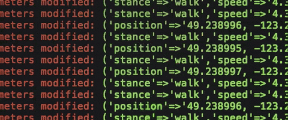

# About me

Location: Saint Louis, Missouri, United States  
* [Email](mailto:chintakmanojkumar.joshi@slu.edu)
* [LinkedIn](https://www.linkedin.com/in/chintak-joshi-882260115/)

---

## Technical Skills
* Languages: JavaScript, TypeScript, Python, Java, XML/HTML, CSS, SQL
* Frameworks: React, Native, Redux, Node.js, Angular.js, Express.js, Django, Bootstrap, Tailwind CSS
* Databases: MySQL, MongoDB, Oracle, PL/SQL
* DevOps & Cloud Services: AWS, Azure, Docker, GitHub, CircleCI, Jira, Slack, Docker
* IDE & Tools: VScode, Pycharm, Eclipse, NetBeans, Postman, Firebase, Linux, Tableau

## Professional Experience
### Software Engineer I | Open-Source at SLU | Saint Louis University, MO
* Architected and deployed robust authentication and authorization mechanisms for an LMS application, leveraging OAuth2, HMAC,and JWT. Implemented deep linking capabilities in compliance with LTI 1.3 standards.
* Implemented features that increased user interaction by 30%, enhancing overall engagement and user satisfaction.

### Software Engineering Intern | Brainybeam Technologies Pvt. Ltd. | India
* Leveraged Agile Scrum methodologies to enhance team productivity and efficiency in software delivery.
* Designed and developed diverse APIs, including RESTful, microservices, and GraphQL.
* Conducted comprehensive regression testing and code reviews, ensuring high software quality and adherence to best practices.

### Software Engineering Intern | Anudip Foundation | India
* Constructed end-to-end web-based solutions that facilitate data processing, analysis, and graphical representation. 
* Orchestrated critical updates in a timely manner, encompassing alterations in content and enhancements in the database structure.
* Ensured high-quality software delivery through rigorous testing and refinement of web-based applications.

### Software Engineering Intern | Bainybeam Technologies Pvt. Ltd. | India
* Employed the Django framework to tailor a dynamic user interface, ensuring seamless usability and exceptional software delivery. 
* Designed and implemented robust APIs to enable seamless integration with various systems. 
* Streamlined and optimized existing websites utilizing cutting-edge front-end web development techniques within advanced content management systems.

## Education
### Master's in Computer Science
**Saint Louis University** • Saint Louis, Missouri • Expected (2024)

### BE in Information Technology
**Gujarat Technological University** • Ahmedabad, Gujarat • 2022

---
